# ETL: World's Largest Banks Data 🏦

This project implements a complete ETL pipeline in Python to track the largest banks worldwide by market capitalization, with beautiful data visualizations.

## Project Architecture
- **Extraction**: Web scraping from Wikipedia using BeautifulSoup.
- **Transformation**: Currency conversion (USD to GBP, EUR, INR) using exchange rate data.
- **Loading**: Storage in a local CSV file and an SQLite database.
- **Visualization**: Automatic generation of 5 professional charts and a comprehensive dashboard.

## Features ✨

### 📊 Data Visualizations
The pipeline automatically generates 5 professional charts and a comprehensive dashboard. All charts are saved as high-resolution PNG files (300 DPI) in the `visualizations/` directory.

#### 1. Top Banks Bar Chart
Horizontal bar chart showing top 10 banks by market cap in USD.


#### 2. Currency Comparison
Grouped bar chart comparing market cap across USD, GBP, and EUR currencies.


#### 3. Market Cap Distribution
Histogram and box plots showing the distribution of market capitalization values.


#### 4. Currency Heatmap
Visual correlation matrix showing market cap values across different currencies for top banks.


#### 5. Comprehensive Dashboard
Multi-panel dashboard with 6 different visualizations including pie charts, bar charts, scatter plots, and statistical summaries.


## How to use
1. Clone the repo: `git clone ...`
2. Install dependencies: `pip install -r requirements.txt`
3. **Install visualization libraries** (required for charts):
   ```bash
   ./install_visualizations.sh
   # OR manually: pip install matplotlib seaborn
   ```
4. Run the script: `python banks_project.py`
5. Check the `visualizations/` folder for generated charts!

> **Note**: If visualizations don't appear, see [INSTALL_VISUALIZATIONS.md](INSTALL_VISUALIZATIONS.md) for troubleshooting.

## Technologies Used
- Python 3.x
- Pandas & Numpy
- BeautifulSoup4
- SQLite3
- Matplotlib (for visualizations)
- Seaborn (for enhanced charts)

## Output Files
- `Largest_banks_data.csv` - Processed data in CSV format
- `Banks.db` - SQLite database with bank data
- `code_log.txt` - Detailed execution log
- `visualizations/` - Directory with 5 PNG chart files (see examples above)

### Pipeline Architecture

```mermaid
graph LR
    A[Wikipedia HTML] -->|Extract| B(Pandas DataFrame)
    B -->|Transform| C{Currency Conversion}
    C -->|Load| D[(SQLite DB)]
    C -->|Load| E[.csv File]
    C -->|Visualize| F[📊 Charts & Dashboard]
    G[exchange_rate.csv] -->|Reference| C
```
