# ETL: World's Largest Banks Data 🏦

This project implements a complete ETL pipeline in Python to track the largest banks worldwide by market capitalization, with beautiful data visualizations.

## Project Architecture
- **Extraction**: Web scraping from Wikipedia using BeautifulSoup.
- **Transformation**: Currency conversion (USD to GBP, EUR, INR) using exchange rate data.
- **Loading**: Storage in a local CSV file and an SQLite database.
- **Visualization**: Automatic generation of 5 professional charts and a comprehensive dashboard.

## Features ✨

### 📊 Data Visualizations
The pipeline automatically generates:
1. **Top Banks Bar Chart** - Horizontal bar chart showing top 10 banks by market cap
2. **Currency Comparison** - Grouped bar chart comparing USD, GBP, and EUR values
3. **Market Cap Distribution** - Histogram and box plots showing data distribution
4. **Currency Heatmap** - Visual correlation matrix across currencies
5. **Comprehensive Dashboard** - Multi-panel dashboard with 6 different visualizations

All charts are saved as high-resolution PNG files (300 DPI) in the `visualizations/` directory.

## How to use
1. Clone the repo: `git clone ...`
2. Install dependencies: `pip install -r requirements.txt`
3. Run the script: `python banks_project.py`
4. Check the `visualizations/` folder for generated charts!

## Technologies Used
- Python 3.x
- Pandas & Numpy
- BeautifulSoup4
- SQLite3
- Matplotlib (for visualizations)
- Seaborn (for enhanced charts)

## Output Files
- `Largest_banks_data.csv` - Processed data in CSV format
- `Banks.db` - SQLite database with bank data
- `code_log.txt` - Detailed execution log
- `visualizations/` - Directory with 5 PNG chart files

### Pipeline Architecture

```mermaid
graph LR
    A[Wikipedia HTML] -->|Extract| B(Pandas DataFrame)
    B -->|Transform| C{Currency Conversion}
    C -->|Load| D[(SQLite DB)]
    C -->|Load| E[.csv File]
    C -->|Visualize| F[📊 Charts & Dashboard]
    G[exchange_rate.csv] -->|Reference| C
```
